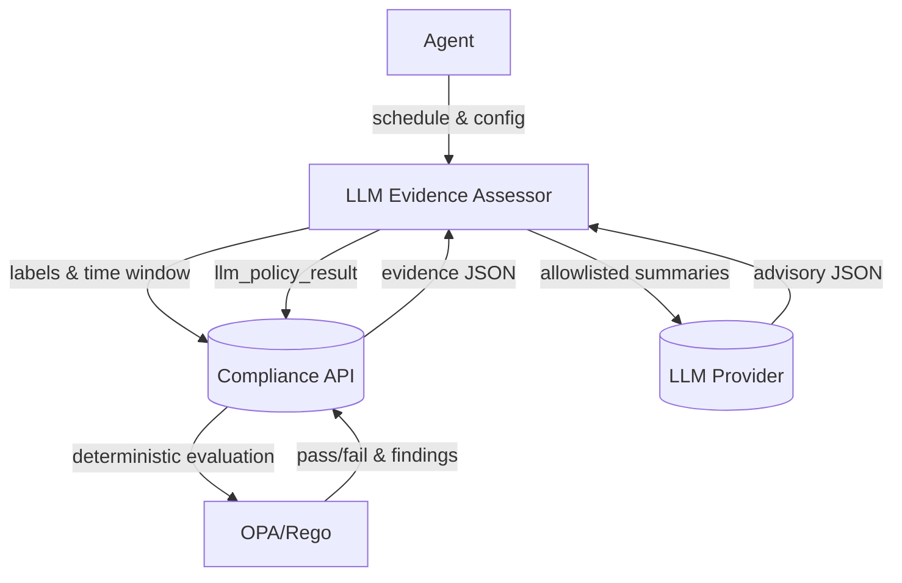

# LLM Evidence Assessor Plugin (PoC)

Generates advisory “hints” (confidence, rationale, citations) from redacted evidence summaries using LLMs. Deterministic policy decisions remain in OPA/Rego.

## Objectives
- Produce non-authoritative hints from LLMs to augment compliance evaluation
- Preserve deterministic decisions in Rego; the plugin never decides pass/fail
- Maintain strict boundaries via out-of-process execution and data minimization

## Architecture


## Data Contracts
- EvidenceSummary: controlId, evidenceId, contentSummary, artifactMeta
- AssessmentRequest: policyContext, evidence[], constraints (provider, model, maxTokens, temperature)
- AssessmentHint: controlId, hintCategory, confidence[0..1], rationale, citations[], recommendedNextSteps[]
- AssessmentResponse: hints[], usageTokenEstimate, provider, model

## Security & Governance
- Out-of-process plugin; least-privilege FS/network
- Input must be redacted: no secrets or large artifacts
- Guardrails: token budgets, rate limits, timeouts, strict JSON validation
- Secrets from env/secret store; never logged; rotated/scoped
- Provenance: model/provider/version, token usage, timestamps

## Build
```bash
go build -o llm-assessor
```

## Local Usage
Fetch → Summarize → Assess (dry-run, no provider call):
```bash
LLM_DRY_RUN=true \
API_URL=http://localhost:8080 \
EVIDENCE_LABELS_JSON='{"team":"ccf","repository":"todo-app"}' \
TIME_WINDOW=24h \
POLICY_FRAMEWORK="NIST 800-53" POLICY_BASELINE="Moderate" \
PROVIDER=openai MODEL=gpt-4.1-mini MAX_TOKENS=800 TEMPERATURE=0.2 \
./llm-assessor
```

Publish advisory results (dry-run with fake hints):
```bash
printf '%s' \
'{"hints":[{"controlId":"AC-1","hintCategory":"coverage","confidence":0.85,"rationale":"Coverage concern","citations":["evidence:sarif:todo-app"]}]}' \
> /tmp/fake_hints.json

LLM_DRY_RUN=true \
API_URL=http://localhost:8080 \
API_TOKEN=${CCF_API_TOKEN:-} \
EVIDENCE_LABELS_JSON='{"team":"ccf","repository":"todo-app"}' \
TIME_WINDOW=24h \
PUBLISH_HINTS=true \
PUBLISH_LABELS_JSON='{"team":"ccf","repository":"todo-app","framework":"NIST-800-53"}' \
LLM_FAKE_JSON_FILE=/tmp/fake_hints.json \
./llm-assessor
```

## Container
```bash
docker build -t plugin-llm-evidence-assessor:local .

docker run --rm -i \
  -v /tmp/llm_req_hints.json:/req.json:ro \
  -v /tmp/fake_hints.json:/fake.json:ro \
  -e LLM_DRY_RUN=true \
  -e LLM_REQ_FILE=/req.json \
  -e LLM_FAKE_JSON_FILE=/fake.json \
  plugin-llm-evidence-assessor:local
```

## Environment Variables
- API_URL, API_TOKEN
- EVIDENCE_LABELS_JSON, TIME_WINDOW (e.g., 24h)
- LLM_DRY_RUN (true/false)
- LLM_FAKE_JSON / LLM_FAKE_JSON_FILE (testing)
- PROVIDER, MODEL, MAX_TOKENS, TEMPERATURE
- PUBLISH_HINTS (true/false), PUBLISH_LABELS_JSON
- OPENAI_API_KEY (live calls), OPENAI_BASE_URL (optional)

## Agent Integration
- No agent changes are required. The agent schedules the plugin like any other plugin.
- The plugin fetches evidence directly from the API using label selectors and time windows, then optionally publishes `llm_policy_result` back to the API.

## Rego Interaction
Hints are non-authoritative inputs; policies remain deterministic. Example pattern:
```rego
package compliance_framework.controls.ac_coverage

warn[msg] {
  some h
  input.hints[h].controlId == "AC-1"
  input.hints[h].hintCategory == "coverage"
  input.hints[h].confidence >= 0.8
  msg := "AC-1 requires review due to LLM coverage hint"
}
```

## Tests
```bash
go test ./... -v
```

## Design
See docs/DESIGN.md for detailed architecture, security, and rollout.

See docs/END_TO_END.md for the end-to-end flow and env configuration.

See docs/FLOW.md for concrete examples; note that the plugin now constructs the request from API evidence (the agent does not pass evidence payloads).

See docs/LOCAL_TESTING.md for a reproducible local setup, seeding examples, and dry‑run commands.
