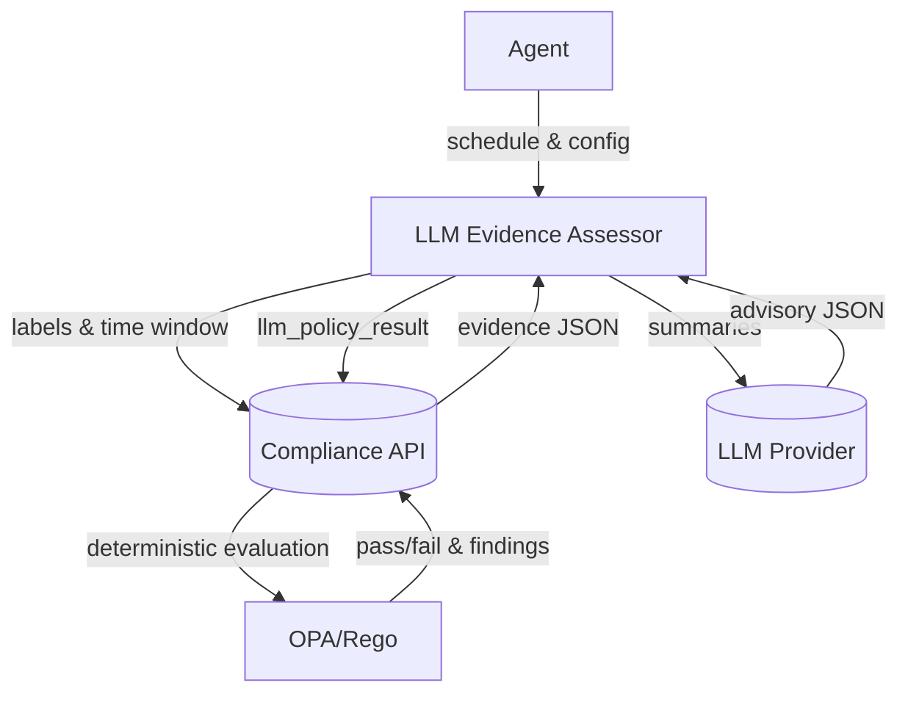

# End-to-End Flow

## Steps
1. Agent schedules the LLM plugin with policy labels and a time window.
2. Plugin retrieves recent evidence from the API using selectors; creates allowlisted summaries.
3. Plugin calls the LLM with summaries; receives advisory JSON outputs.
4. Plugin publishes advisory results as `llm_policy_result` to the API with provenance and citations.
5. OPA/Rego runs deterministically on evidence; advisory results are available for review alongside outcomes.

## Environment Variables
- API_URL, API_TOKEN
- EVIDENCE_LABELS_JSON, TIME_WINDOW
- PROVIDER, MODEL, MAX_TOKENS, TEMPERATURE
- PUBLISH_HINTS, PUBLISH_LABELS_JSON
- LLM_DRY_RUN, LLM_FAKE_JSON_FILE, OPENAI_API_KEY
