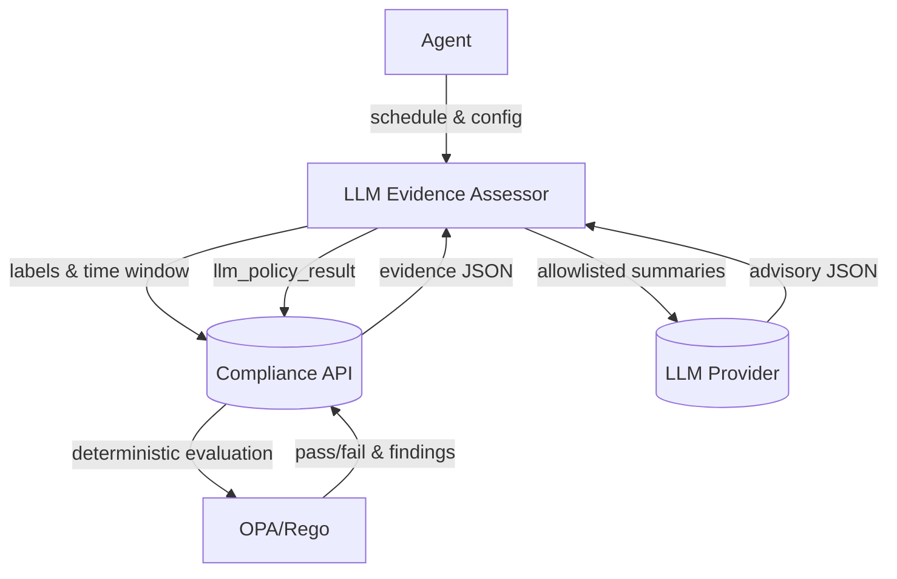

# LLM Plugin Flow and Examples

## Overview
This document shows the end-to-end flow and concrete JSON examples for how the LLM plugin integrates with evidence plugins and Rego policies.

## Architecture (Mermaid)


## AssessmentRequest (Constructed by Plugin)
```json
{
  "policyContext": {
    "framework": "NIST 800-53",
    "baseline": "Moderate"
  },
  "evidence": [
    {
      "controlId": "AC-1",
      "evidenceId": "sarif:todo-app",
      "contentSummary": "High:2, Medium:1, tool:golangci-lint, categories:[access-control]",
      "artifactMeta": {
        "basename": "out_sarif.json"
      }
    },
    {
      "controlId": "AC-2",
      "evidenceId": "attest:golangci",
      "contentSummary": "attestation_exists:true, signer_approved:true, issuer_approved:true",
      "artifactMeta": {
        "basename": ".golangci.yml"
      }
    }
  ],
  "constraints": {
    "provider": "openai",
    "model": "gpt-4.1-mini",
    "maxTokens": 1000,
    "temperature": 0
  }
}
```

## AssessmentResponse (LLM Plugin → Agent)
```json
{
  "hints": [
    {
      "controlId": "AC-1",
      "hintCategory": "coverage",
      "confidence": 0.85,
      "rationale": "SARIF indicates repeated high-severity issues around access control constraints; potential gaps in implementation.",
      "citations": ["artifact:sarif:todo-app"],
      "recommendedNextSteps": [
        "Prioritize remediation of high-severity AC findings",
        "Review role/permission model in todo-app"
      ]
    },
    {
      "controlId": "AC-2",
      "hintCategory": "assurance",
      "confidence": 0.72,
      "rationale": "Attestation present; signer matches approved identity; moderate assurance.",
      "citations": ["artifact:attest:golangci"]
    }
  ],
  "usageTokenEstimate": 327,
  "provider": "openai",
  "model": "gpt-4.1-mini"
}
```

## OPA/Rego Input (Deterministic Path)
```json
{
  "evidence": {
    "files": {
      "sarif": {
        "id": "sarif:todo-app",
        "summary": { "high": 2, "medium": 1 }
      }
    },
    "attestation": {
      "golangci": {
        "id": "attest:golangci",
        "exists": true,
        "signerApproved": true,
        "issuerApproved": true
      }
    }
  },
  "hints": [
    {
      "controlId": "AC-1",
      "hintCategory": "coverage",
      "confidence": 0.85,
      "rationale": "Coverage concern based on severity distribution",
      "citations": ["evidence:sarif:todo-app"]
    },
    {
      "controlId": "AC-2",
      "hintCategory": "assurance",
      "confidence": 0.72,
      "rationale": "Attestation present with approved signer",
      "citations": ["evidence:attest:golangci"]
    }
  ],
  "context": {
    "framework": "NIST 800-53",
    "baseline": "Moderate"
  }
}
```

## Rego Examples (Using Hints Safely)
Raise a review flag when a high-confidence coverage hint exists for AC-1:
```rego
package compliance_framework.controls.ac_coverage

warn[msg] {
  some i
  h := input.hints[i]
  h.controlId == "AC-1"
  h.hintCategory == "coverage"
  h.confidence >= 0.8
  msg := sprintf("AC-1 requires review: %s", [h.rationale])
}
```

Combine deterministic evidence with hints:
```rego
package compliance_framework.attestation

deny[msg] {
  input.evidence.attestation.golangci.exists == false
  msg := "Attestation for .golangci.yml is missing"
}

observe[msg] {
  some i
  input.evidence.attestation.golangci.exists
  h := input.hints[i]
  h.controlId == "AC-2"
  h.hintCategory == "assurance"
  h.confidence >= 0.7
  msg := sprintf("AC-2 assurance noted: %s", [h.rationale])
}
```
